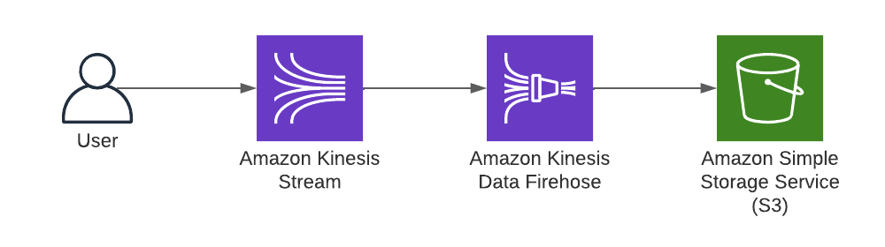

# Streaming Data to Amazon S3 Using Amazon Kinesis Data Firehose

## Problem
You need to deliver incoming streaming data to object storage.

## Solution
Create an S3 bucket, create a Kinesis stream, and configure Kinesis Data Firehose to deliver the stream data to the S3 bucket. 



### Prerequisites
- Kinesis stream
- S3 Bucket with a CSV file

### Preparation
Preparation
### Set a unique suffix to use for the S3 bucket name:
```
RANDOM_STRING=$(aws secretsmanager get-random-password \
--exclude-punctuation --exclude-uppercase \
--password-length 6 --require-each-included-type \
--output text \
--query RandomPassword)
```

### Create a S3 bucket for data:
```
aws s3api create-bucket --bucket awscookbook702-$RANDOM_STRING
```

### Create a Kinesis stream:
```
aws kinesis create-stream --stream-name AWSCookbook702 --shard-count 1
```

### Confirm that your stream is in ACTIVE state:
```
aws kinesis describe-stream-summary --stream-name AWSCookbook702
```

## Steps
1. Open the Kinesis Data Firehose console and click the “Create delivery stream” button; choose Amazon Kinesis Data Streams for the source and Amazon S3 for the destination, as shown in Figure 2.


2. For Source settings, choose the Kinesis stream that you created in the preparation steps, as shown in Figure 3.


3. Keep the defaults (Disabled) for “Transform and convert records” options. For Destination settings, browse for and choose the S3 bucket that you created in the preparation steps as shown in Figure 4, and keep the defaults for the other options (disabled partitioning and no prefixes).


4. Under the Advanced settings section, confirm that the “Create or update IAM role” is selected. This will create an IAM role that Kinesis can use to access the stream and S3 bucket, as shown in Figure 5.


## Validation checks

You can test delivery to the stream from within the Kinesis console. Click the Delivery streams link in the left navigation menu, choose the stream you created, expand the “Test with demo data” section, and click the “Start sending demo data” button. This will initiate sending sample data to your stream so you can verify that it is making it to your S3 bucket.


After a few minutes, you will see a folder structure and a file appear in your S3 bucket, similar to Figure 7.


If you download and inspect the file, you will see output similar to the following:

```
{"CHANGE":3.95,"PRICE":79.75,"TICKER_SYMBOL":"SLW","SECTOR":"ENERGY"}
{"CHANGE":7.27,"PRICE":96.37,"TICKER_SYMBOL":"ALY","SECTOR":"ENERGY"}
{"CHANGE":-5,"PRICE":81.74,"TICKER_SYMBOL":"QXZ","SECTOR":"HEALTHCARE"}
{"CHANGE":-0.6,"PRICE":98.4,"TICKER_SYMBOL":"NFLX","SECTOR":"TECHNOLOGY"}
{"CHANGE":-0.46,"PRICE":18.92,"TICKER_SYMBOL":"PLM","SECTOR":"FINANCIAL"}
{"CHANGE":4.09,"PRICE":100.46,"TICKER_SYMBOL":"ALY","SECTOR":"ENERGY"}
{"CHANGE":2.06,"PRICE":32.34,"TICKER_SYMBOL":"PPL","SECTOR":"HEALTHCARE"}
{"CHANGE":-2.99,"PRICE":38.98,"TICKER_SYMBOL":"KFU","SECTOR":"ENERGY"}
```

## Clean up 

You can delete the Kinesis Delivery Stream and Kinesis Stream from within the Kinesis console. Click the Delivery streams link in the left navigation menu, choose the stream you created, and click the Delete delivery stream button. Click the Data streams link and choose your data stream, then click the Delete stream button.

Empty the S3 bucket that you created and delete the bucket using the S3 console. You can click the “Empty” button and then the Delete button to accomplish this.

### Delete the Kinesis Stream:
`aws kinesis delete-stream --stream-name AWSCookbook702`

### Clean up the local variable you created:
`unset RANDOM_STRING`

## Discussion

As you begin to ingest data from various sources, your application may be consuming or reacting to streaming data in real time. In some cases, you may want to store the data from the stream to query or process it later. You can use Kinesis Data Firehose to deliver data to object storage (S3), Amazon Redshift, OpenSearch, and many third-party endpoints. You can also connect multiple delivery streams to a single producer stream to deliver data if you have to support multiple delivery locations from your streams.

> Note: Kinesis Data Firehose scales automatically to handle the volume of data you need to deliver, meaning that you do not have to configure or provision additional resources if your data stream starts to receive large volumes of data. For more information on Kinesis Data Firehose features and capabilities, see the AWS documentation for [Kinesis Data Firehose](https://docs.aws.amazon.com/firehose/latest/dev/what-is-this-service.html).

If you need to transform data before it ends up in the destination via Firehose, you can configure transformations. A transformation will automatically invoke a Lambda function as your streaming data queues up (see [this Firehose article](https://docs.aws.amazon.com/firehose/latest/dev/data-transformation.html) for buffer size information). This is useful when you have to adjust the schema of a record before delivery, sanitize data for long-term storage on the fly (e.g., remove personally identifiable information), or join the data with other sources before delivery. The transformation Lambda function you invoke must follow the convention specified by the Kinesis Data Firehose API. To see some examples of Lambda functions, go to the [AWS Serverless Application Repository](https://aws.amazon.com/serverless/serverlessrepo/) and search for “firehose.”

## Challenge

Configure a Firehose delivery with transformations to remove a field from the streaming data before delivery. 

